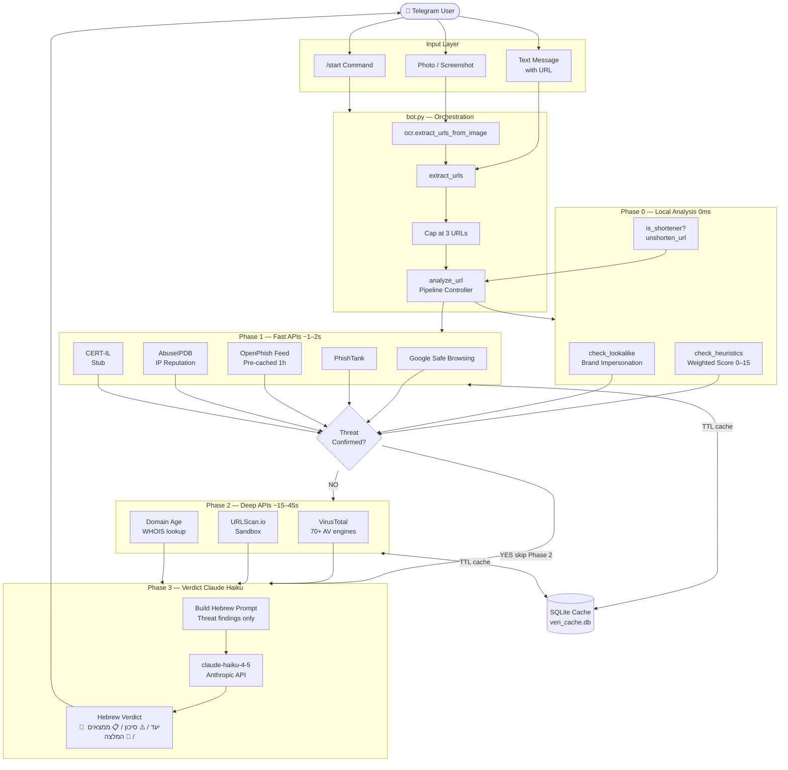
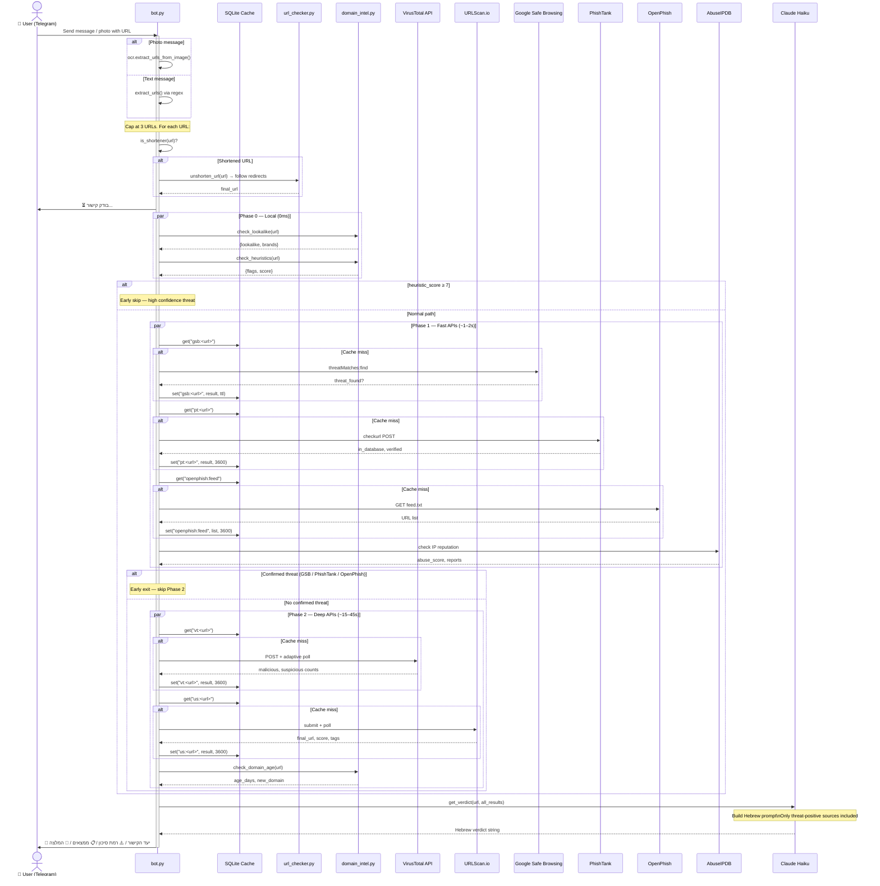
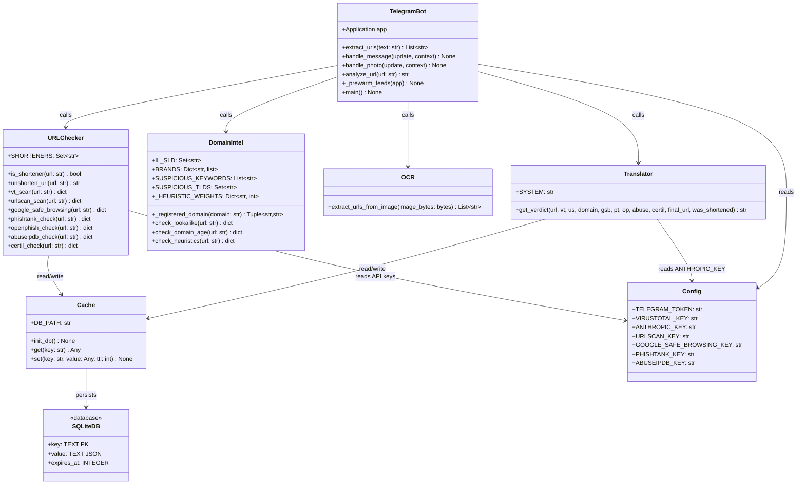
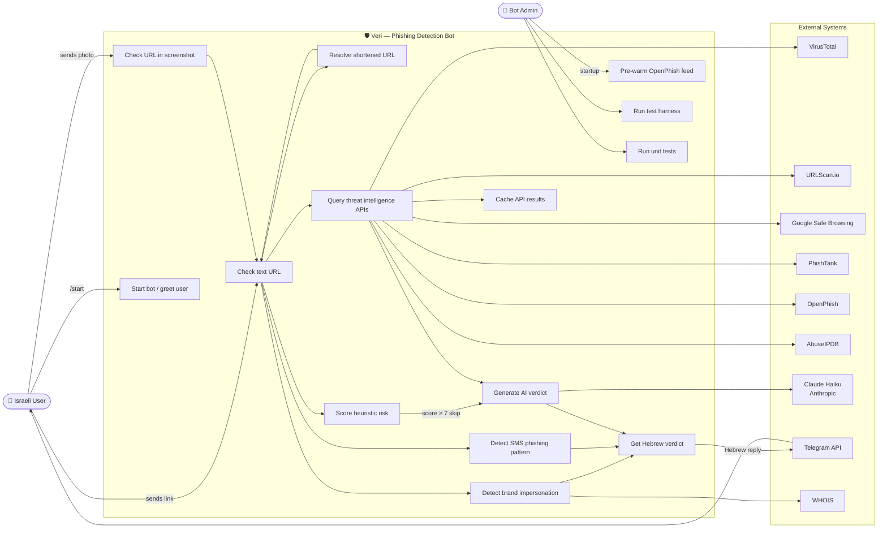

# Veri — System Specification

Telegram-based phishing & scam detection bot for Israeli users. Analyzes URLs via multi-source threat intelligence and returns Hebrew security verdicts using Claude AI.

---

## Architecture Flow Diagram

---

## Sequence Diagram

---

## UML Class Diagram

---

## Use Case Diagram

---

## Component Summary

| Component | File | Role |
|-----------|------|------|
| Telegram Handler | `bot.py` | Entry point; URL extraction; pipeline orchestration |
| Threat Intel | `analyzer/url_checker.py` | 7 external APIs; URL unshortening; cache integration |
| Domain Analysis | `analyzer/domain_intel.py` | Heuristics; lookalike; WHOIS; Israeli TLD parsing |
| OCR | `analyzer/ocr.py` | Tesseract — extract URLs from images |
| Verdict Engine | `translator.py` | Claude Haiku prompt + Hebrew output |
| Cache | `cache.py` | SQLite TTL cache; prevents quota exhaustion |
| Config | `config.py` | `.env` loader; API key constants |

## Risk Levels

| Level | Hebrew | Trigger Condition |
|-------|--------|-------------------|
| High | גבוהה | Confirmed by VT / GSB / PhishTank / OpenPhish OR heuristic ≥ 7 |
| Medium | בינונית | Heuristic score 4–6 OR new domain + suspicious signals |
| Unverified | לא ניתן לאמת | No threats found but shortened / new domain / low confidence |

## API Cache TTLs

| Source | Clean TTL | Threat TTL |
|--------|-----------|------------|
| VirusTotal | 3600s | 3600s |
| URLScan | 3600s | 3600s |
| Google Safe Browsing | 900s | 86400s |
| PhishTank | 3600s | 3600s |
| OpenPhish feed | 3600s | 3600s |
| AbuseIPDB | 3600s | 3600s |
